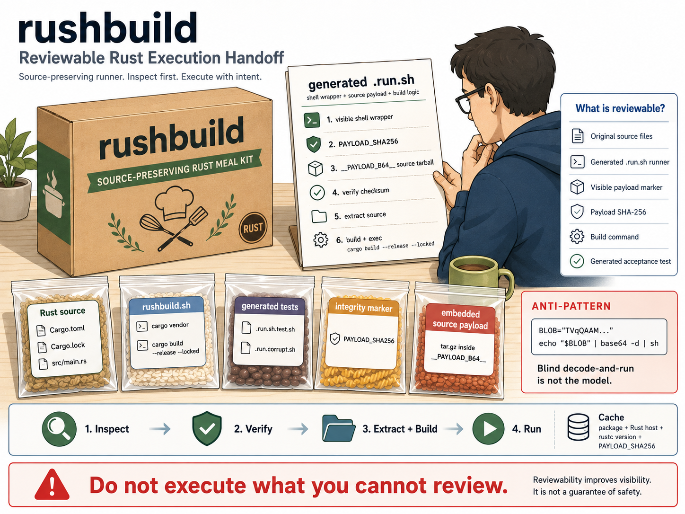

# rushbuild

Reviewable Rust execution handoffs.

`rushbuild` makes Rust build behavior visible, version-controlled, and reviewable before it runs locally or in CI.

> Do not execute what you cannot review.

`rushbuild` is a reference implementation of `RUSHB-001` from [`runplus-community/reviewable-workflows`](https://github.com/runplus-community/reviewable-workflows/blob/dev/specs/execution-handoffs/rushbuild.md).

## Why This Exists

Build and release helpers are often hidden in README instructions, CI config, local scripts, or binary-only handoffs.

`rushbuild.sh` packs Rust crates into single self-contained runnable `.sh` files.

`rushbuild` packages Rust source projects into source-preserving shell runners.

The current implementation is intentionally Rust-focused.

The bundle preserves the crate source and build inputs, then emits a single
`sh` entry point that extracts, verifies, builds, and executes the Rust program
at runtime.

`rushbuild` is the Rust mirror of [`goshbuild`](https://github.com/runplus-community/goshbuild).
The broader cross-language direction belongs in
[`reviewable-workflows`](https://github.com/runplus-community/reviewable-workflows).
Use `goshbuild` for Go execution handoffs and `rushbuild` for Rust execution
handoffs.

## How It Connects To Reviewable Workflow Handoffs

Reviewable Workflow Handoffs is the spec direction from [`runplus-community/reviewable-workflows`](https://github.com/runplus-community/reviewable-workflows).

`rushbuild` implements the Rust execution handoff lane: it answers what source and build behavior are being handed to a developer shell or CI runner before execution.

## Visual Model



## Before / After

Before:

- build behavior can be scattered across README steps, CI config, local scripts, or binary-only handoffs
- reviewers may not have one clear artifact to inspect before execution

After:

- the source-preserving runner is the handoff artifact
- reviewers can inspect the runner, payload hash, Cargo build path, and generated test before running it
- first run verifies, extracts, builds, and executes; later runs can use the warm cache

Root-level entry points:

- `rushbuild.sh` for shell environments
- `rushbuild.ps1` as the PowerShell wrapper for Windows
- `test_rushbuild.sh` as the higher-order demo harness

## Install / Build

No package install is required for the current shell implementation.

Run the packer from this repo:

```bash
bash ./rushbuild.sh pack ./demo-apps/rust-demo ./dists/dist-rust-demo/demo-app.run.sh
```

On Windows, use the PowerShell wrapper:

```powershell
powershell -ExecutionPolicy Bypass -File .\rushbuild.ps1 pack .\demo-apps\rust-demo .\dists\dist-rust-demo\demo-app.run.sh
```

## Quick Start

```bash
bash ./test_rushbuild.sh
bash ./dists/dist-rust-demo/demo-app.run.sh --help
```

```powershell
bash ./test_rushbuild.sh
bash .\dists\dist-rust-demo\demo-app.run.sh --help
```

## Output

`pack` creates:

- `<name>.run.sh` - the self-contained runner
- `<name>.run.sh.test.sh` - acceptance tests for the runner

The generated runner embeds a tarball of the crate source, verifies the
payload hash, extracts into a cache directory, builds the Rust binary with
`cargo build --release`, and then `exec`s the binary with the original
arguments.

In the demo flow, the generated scripts land in `dists/dist-rust-demo/`,
and you can run the `.run.sh` and `.test.sh` files directly with `bash`.

## Packing Flow

```text
+-------------------------------+     +-------------------------------+     +-------------------------------+
| RUST CRATE SOURCE             | --> | RUSHBUILD PACK                | --> | GENERATED RUNNER              |
| Cargo.toml / Cargo.lock / src |     | vendor / tar / hash / b64     |     | <name>.run.sh                 |
| source stays in payload       |     | runner stub + checksum        |     | one runnable file             |
+-------------------------------+     +-------------------------------+     +---------------+---------------+
                                                                                        |
                                                                                        v
                                                           +----------------------------+----------------------------+
                                                           | COLD CACHE                 | WARM CACHE                 |
                                                           | first run in new env       | later runs in same env     |
                                                           | verify -> extract -> build | cache hit -> exec          |
                                                           | exec                       |                            |
                                                           +----------------------------+----------------------------+
```

## Behavior

- Any supported project type can be delivered as a single `sh` entry point.
- Rust crates are the first supported project type.
- The source tree remains multi-file and inspectable, while the handoff artifact stays single-file.
- The first run in a new environment performs a Cargo build; later runs reuse the cached binary when the cache key matches.
- Payload verification happens before extraction, which provides a corruption check before any source is unpacked.
- Cache keys include package identity, Rust host triple, rustc version, and payload hash.
- `cargo vendor` runs before packing so vendored dependencies can travel with the payload.
- `goshbuild` provides the same model for Go modules.
- Future language lanes can reuse the same runner contract with a different build step.

## Use Cases

### 1. CI/CD helper

A repository needs a Rust-based helper, release step, or validation shim that
should be delivered as one runnable file. `rushbuild` packages that helper into
one runner while preserving the source.

### 2. Repeated internal automation

Teams can package Rust tools for code generation, validation, repo maintenance,
or release automation. The first run builds the binary; repeat runs hit the
cache until the source, toolchain, or target host changes.

### 3. Support and incident-response bundle

An ops or support team can package a Rust recovery tool and hand off one
`.run.sh` file. The runner verifies the payload before extraction and builds a
fresh binary in the target environment.

### 4. Release handoff

The source project can remain split across many files, modules, and Cargo
metadata, while the delivered artifact stays one runnable file.

### 5. Rust execution handoff

The runner preserves the Rust source tree and Cargo metadata while still
delivering one runnable file. Cross-language handoff specs belong in
[`reviewable-workflows`](https://github.com/runplus-community/reviewable-workflows);
this repo stays focused on Rust.

## Demo app

`demo-apps/rust-demo/` contains only the Rust crate. The higher-order bundle script is at
[`test_rushbuild.sh`](test_rushbuild.sh) in the repo root and packs the demo app
into `dists/dist-rust-demo/`.

```bash
bash ./test_rushbuild.sh
bash ./dists/dist-rust-demo/demo-app.run.sh --help
bash ./dists/dist-rust-demo/demo-app.run.sh.test.sh
```

```powershell
bash ./test_rushbuild.sh
bash .\dists\dist-rust-demo\demo-app.run.sh --help
bash .\dists\dist-rust-demo\demo-app.run.sh.test.sh
```

## Post-build Outputs

```text
dists/
|-- dist-rust-demo/
|   |-- README.md
|   |-- demo-app.run.sh
|   |-- demo-app.run.sh.test.sh
|   `-- demo-app.run.corrupt.sh
```

You can run these scripts directly with `bash`.

For a runner-focused breakdown, see [dists/dist-rust-demo/README.md](dists/dist-rust-demo/README.md).

## Demo Lanes

```text
demo-apps/
|-- rust-demo/
|   |-- Cargo.toml
|   |-- Cargo.lock
|   `-- src/main.rs
```

Use [`goshbuild`](https://github.com/runplus-community/goshbuild) for Go
execution handoff demos.

## Validation

Current workspace validation:

- `bash -n ./rushbuild.sh`
- `bash -n ./test_rushbuild.sh`
- PowerShell parse of `rushbuild.ps1`
- `bash ./test_rushbuild.sh`
- `bash ./dists/dist-rust-demo/demo-app.run.sh.test.sh`
- GitHub Actions CI workflow added at [.github/workflows/ci.yml](.github/workflows/ci.yml)

The demo test suite passed `16/16` in this workspace.

## Requirements

For the current Rust implementation:

- `cargo`
- `rustc`
- `tar`
- `base64`
- `bash` for the generated runner

## Reviewability Model

Before trusting a `rushbuild` handoff, review:

- the source crate being packed
- the generated `.run.sh` runner
- the payload checksum
- the embedded payload marker and generated test script
- the `cargo build --release --locked` path inside the runner
- the cache key inputs: package identity, Rust host, rustc version, and payload hash

The runner verifies the payload before extraction, builds with Cargo, caches the binary, and then `exec`s the result with the original arguments.

## Security Notes

`rushbuild` does not guarantee safe execution and does not replace dependency scanning, signing, SLSA, OpenSSF Scorecard, SBOMs, CI hardening, sandboxing, or code review.

It focuses on making the Rust execution handoff visible and reviewable before it runs.

## Non-Goals

- replacing Cargo
- replacing CI security
- proving that embedded source is safe
- proving that generated runners are safe to execute without review
- replacing normal code review

## Language Scope

- Current support: Rust crates through Cargo.
- Go reference implementation: [`goshbuild`](https://github.com/runplus-community/goshbuild).
- Cross-language spec direction: [`reviewable-workflows`](https://github.com/runplus-community/reviewable-workflows).

## Release Notes

- [CHANGELOG.md](CHANGELOG.md)
- [RELEASE.md](RELEASE.md)

## Contributing

Contributions should improve clarity, inspectability, reproducibility, accurate docs, and tests. Avoid adding hidden execution behavior.

## License

MIT. See [LICENSE](LICENSE).
